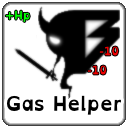
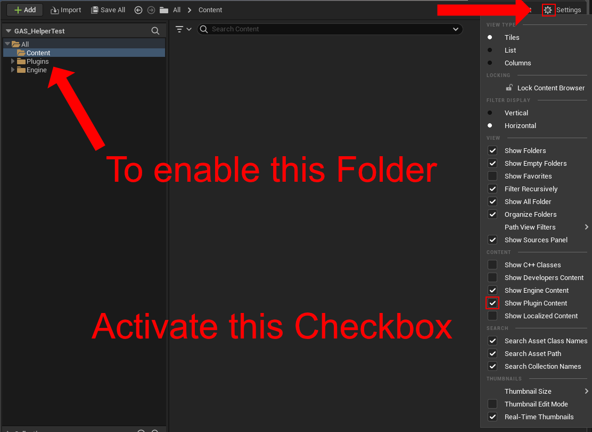
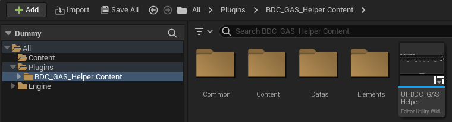
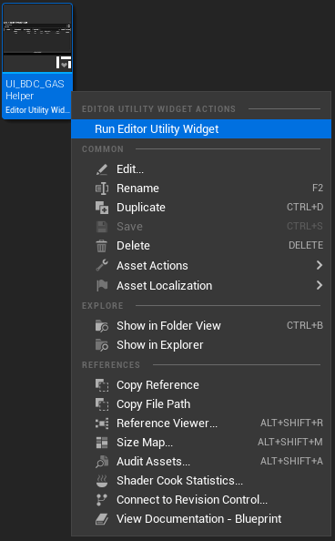
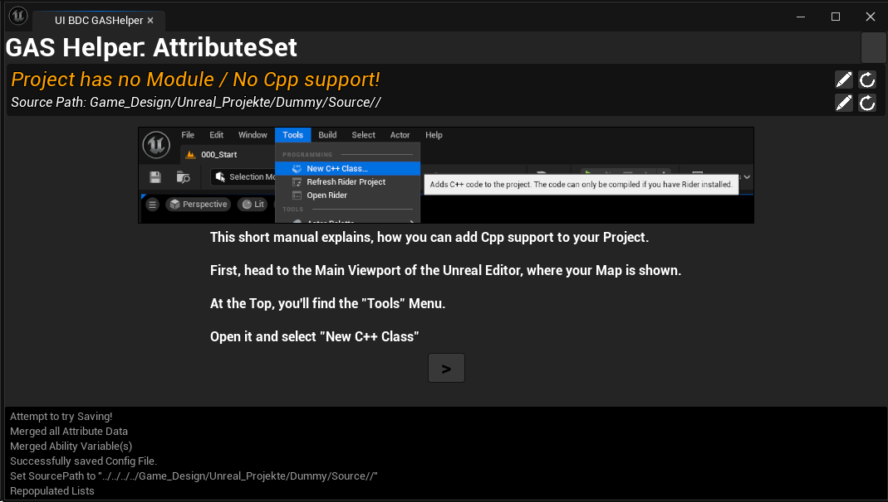
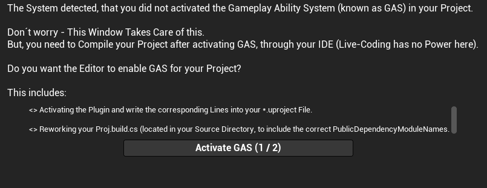
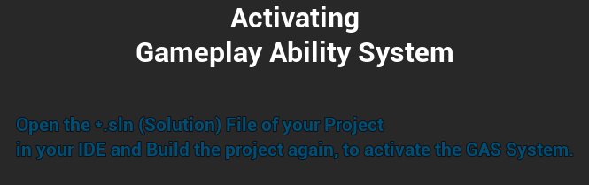

<p align="center">
  
</p>

# GAS HELPER

+ [Installing the Plugin](https://github.com/BDCPatrick/BDC_GasHelper_Doc/edit/main/README.md#installing-the-plugin)
+ [Getting started for a BP-only project](https://github.com/BDCPatrick/BDC_GasHelper_Doc/edit/main/README.md#getting-started-for-a-bp-only-project)
   - [Requirements](https://github.com/BDCPatrick/BDC_GasHelper_Doc/edit/main/README.md#requirements)
   - [Run the Plugin Widget](https://github.com/BDCPatrick/BDC_GasHelper_Doc/edit/main/README.md#run-the-plugin-widget)
   - [Activate C++](https://github.com/BDCPatrick/BDC_GasHelper_Doc/edit/main/README.md#run-the-plugin-widget)
+ [Activate the GameplayAbilitySystem](https://github.com/BDCPatrick/BDC_GasHelper_Doc/edit/main/README.md#activate-the-gameplayabilitysystem)
+ [The Widget](https://github.com/BDCPatrick/BDC_GasHelper_Doc/edit/main/README.md#the-widget)


## Installing the Plugin
After you purchased the Plugin, head to the EpicGames Launcher, to the Unreal Engine Tab, and open your Library there. In the "Vault" Section, search for the Gas Helper Plugin and add it to your Project.

**Be aware of**: The Gas helper Plugins only works for Unreal Engine Version 5.3 and newer, since it depends on Plugins that are only available for those Versions.


## Getting started for a BP-only project
### Requirements
The Gameplay Ability System ( from now on named ```GAS``` needs Source Code to run in your Project. While the Plugin itself has a small Doc of how to enable Source in your Project, you have to take care of installing an IDE (f.e.: [Visual Studio (Community)](https://visualstudio.microsoft.com/de/vs/community/) or [Jetbrain Rider](https://www.jetbrains.com/de-de/rider/)) by yourself.

It is also recommended to **always** create your Project as a C++ project, and not a Blueprint one. Since C++ projects can also handle Blueprint by Default, while Blueprint Projects need to enable Source-Support via the Editor Tools.

Epic Games provides a good Doc about, how to Setup Visual Studio for Unreal Engine: [Setting Up Visual Studio for Unreal Engine](https://docs.unrealengine.com/4.26/en-US/ProductionPipelines/DevelopmentSetup/VisualStudioSetup/)


### Run the Plugin Widget
If this is the first time you want to open an EditorutilityWidget from a Plugin Directory, you need to enable the ```Show Plugin Content``` Option in the Content Browser Settings.
You can find it here:
<p align="center">
  
</p>

After activating the Checkbox, the ```Plugins``` Folder gets visible in the Content browser.

Open the Plugins Folder and inside, open the ```BDC_Gas_Helper_Content``` Folder.
<p align="center">
  
</p>

Rightclick the "UI_BDC_Gas_Helper" Asset (the only one with a Thumbnail) and select ```Run Editor Utility Widget```
<p align="center">
  
</p>


### Activate C++
When running the Widget and no Source code is enabled in your Project, the Widget will guide you through the Process of Enabling it.
<p align="center">
  
</p>

**Keep in Mind**: You need to have an IDE Software installed, that can handle C++ Projects, like f.e.: [Visual Studio (Community)](https://visualstudio.microsoft.com/de/vs/community/) or [Jetbrain Rider](https://www.jetbrains.com/de-de/rider/).


### Activate the GameplayAbilitySystem
After you successfully enabled Sourc-Support in your Project (or you started it as a C++ Project), you can open the Widget again.

This Time, the Widget should recognize the enabled Source-Support. If you already set up GAS for this Project, the Widget will skip the next Step.
If GAS is not activated yet, you will be guided to the Actiavtaion Page.

On this Page, the Widget will edit your *.Build.cs and your *.uproject File to place in the GAS Dependencies. This will happen automatically when doubleclicking the ```Activate GAS``` Button.
<p align="center">
  
</p>

Just wait until the needed Lines are added to the Files and follow the Instructions on the final Page.
<p align="center">
  
</p>

You are now ready to start using GAS.

## The Widget
