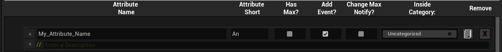

<p align="center">
  
</p>

# GAS HELPER

+ [Installing the Plugin](https://github.com/BDCPatrick/BDC_GasHelper_Doc/edit/main/README.md#installing-the-plugin)
+ [Getting started for a BP-only project](https://github.com/BDCPatrick/BDC_GasHelper_Doc/edit/main/README.md#getting-started-for-a-bp-only-project)
   - [Requirements](https://github.com/BDCPatrick/BDC_GasHelper_Doc/edit/main/README.md#requirements)
   - [Run the Plugin Widget](https://github.com/BDCPatrick/BDC_GasHelper_Doc/edit/main/README.md#run-the-plugin-widget)
   - [Activate C++](https://github.com/BDCPatrick/BDC_GasHelper_Doc/edit/main/README.md#run-the-plugin-widget)
+ [Activate the GameplayAbilitySystem](https://github.com/BDCPatrick/BDC_GasHelper_Doc/edit/main/README.md#activate-the-gameplayabilitysystem)
+ [The Widget](https://github.com/BDCPatrick/BDC_GasHelper_Doc/edit/main/README.md#the-widget)
   - [Tab-Settings](https://github.com/BDCPatrick/BDC_GasHelper_Doc/edit/main/README.md#tab-settings)
   - [Tab-Attibutes](https://github.com/BDCPatrick/BDC_GasHelper_Doc/edit/main/README.md#tab-attributes)
      - [Attributes](https://github.com/BDCPatrick/BDC_GasHelper_Doc/edit/main/README.md#attributes)
   - [Tab-Categories](https://github.com/BDCPatrick/BDC_GasHelper_Doc/edit/main/README.md#tab-categories)
   - [Tab-Ability](https://github.com/BDCPatrick/BDC_GasHelper_Doc/edit/main/README.md#tab-ability)
+ [The Generator](https://github.com/BDCPatrick/BDC_GasHelper_Doc/edit/main/README.md#the-generator)
+ [The generated Files](https://github.com/BDCPatrick/BDC_GasHelper_Doc/edit/main/README.md#the-generated-files)
   - [The Characters](https://github.com/BDCPatrick/BDC_GasHelper_Doc/edit/main/README.md#the-characters)
   - [The Types](https://github.com/BDCPatrick/BDC_GasHelper_Doc/edit/main/README.md#the-types)


## Installing the Plugin
After you purchased the Plugin, head to the EpicGames Launcher, to the Unreal Engine Tab, and open your Library there. In the "Vault" Section, search for the Gas Helper Plugin and add it to your Project.

**Be aware of**: The Gas helper Plugins only works for Unreal Engine Version 5.3 and newer, since it depends on Plugins that are only available for those Versions.


## Getting started for a BP-only project
### Requirements
The Gameplay Ability System ( from now on named ```GAS``` needs Source Code to run in your Project. While the Plugin itself has a small Doc of how to enable Source in your Project, you have to take care of installing an IDE (f.e.: [Visual Studio (Community)](https://visualstudio.microsoft.com/de/vs/community/) or [Jetbrain Rider](https://www.jetbrains.com/de-de/rider/)) by yourself.

It is also recommended to **always** create your Project as a C++ project, and not a Blueprint one. Since C++ projects can also handle Blueprint by Default, while Blueprint Projects need to enable Source-Support via the Editor Tools.

Epic Games provides a good Doc about, how to Setup Visual Studio for Unreal Engine: [Setting Up Visual Studio for Unreal Engine](https://docs.unrealengine.com/4.26/en-US/ProductionPipelines/DevelopmentSetup/VisualStudioSetup/)


### Run the Plugin Widget
If this is the first time you want to open an EditorutilityWidget from a Plugin Directory, you need to enable the ```Show Plugin Content``` Option in the Content Browser Settings.
You can find it here:
<p align="center">
  
</p>

After activating the Checkbox, the ```Plugins``` Folder gets visible in the Content browser.

Open the Plugins Folder and inside, open the ```BDC_Gas_Helper_Content``` Folder.
<p align="center">
  
</p>

Rightclick the "UI_BDC_Gas_Helper" Asset (the only one with a Thumbnail) and select ```Run Editor Utility Widget```
<p align="center">
  
</p>


### Activate C++
When running the Widget and no Source code is enabled in your Project, the Widget will guide you through the Process of Enabling it.
<p align="center">
  
</p>

**Keep in Mind**: You need to have an IDE Software installed, that can handle C++ Projects, like f.e.: [Visual Studio (Community)](https://visualstudio.microsoft.com/de/vs/community/) or [Jetbrain Rider](https://www.jetbrains.com/de-de/rider/).


### Activate the GameplayAbilitySystem
After you successfully enabled Sourc-Support in your Project (or you started it as a C++ Project), you can open the Widget again.

This Time, the Widget should recognize the enabled Source-Support. If you already set up GAS for this Project, the Widget will skip the next Step.
If GAS is not activated yet, you will be guided to the Actiavtaion Page.

On this Page, the Widget will edit your *.Build.cs and your *.uproject File to place in the GAS Dependencies. This will happen automatically when doubleclicking the ```Activate GAS``` Button.
<p align="center">
  
</p>

Just wait until the needed Lines are added to the Files and follow the Instructions on the final Page.
<p align="center">
  
</p>

You are now ready to start using GAS.


## The Widget
### Tab-Settings
<p align="center">
  
</p>
The Settings are the first tab of the Widget and allows you to change the Filenames of the out coming Source files, as well as lets you decide, what files should be generated, if old files should be backuped and what Attribute is the actual Health Attribute.
Let´s get though some Points here:

```Current API```: It is always the Header of the Widget, regardless of what Tab you are in. The API_Name of your Project can be different from your project's name. You can edit the API name with the Pencil Button at the right, but it's not recommended to do so. The Input only allows Letters and Underscores!

```Source Path```: This is the actual Path to the Source Directory of your Project. Normally, it is ```<ProjectRoot>/Source/<ProjectName>```. You can define a different Sourcepath, but it's recommended to keep the default one. The Input only allows Letters and Underscores!

```The Tabs```: You can choose between Settings, Attributes, Categories, and Ability. Each tab leads you to a different Window of Lists and Settings. We come back to the other Tabs later.

```The "R" Button```: This Buttons refreshes the Lists you will edit later, if you want to refresh them amnually.

```Generate GAS Code```: This Button is elemental. After clicking it 3 times, the Helper will start generating the GAS Files, according to your Lists and entries. This process can not be cancelled!

```The Filenames```: While the Widget comes with Default Filenames for the generated Files, it's recommended to write your own ones. The colored Progress bars will give you a hint on how many Signs are the maximum (currently 32). You shouldn't add an Extension to the Filenames, since the Generator will add them by itself. The Inputs only allow Letters and Underscores!
        **Keep in Mind:** The Files with the given Name will get overwritten by the Generator. Make sure to not use a Name twice or add a Name of an existing Sourcefile!

```Health Attribute```: When one or more Attributes are added later, you can come back here and set the Health Attribute that should be used by the IsAlive function for the Character. By Default, this is set to the first Attribute you are adding. The generator will cancel its process, when this value is not set.

```Toggles```: You don't want the Helper to generate specific Files, cause you created some by yourself or plan to do so? no Problem, simply switch the Generating of specific Files On or OFF.

```Copy Backup```: You want to keep this set to be activated. If you accidentally generated files and overwrite your edits, the backups of the old ones are copied over to ```<ProjectRoot>/SourceBackup/```, so you can rescue your Changes.

```make Config pretty```: This is just for People who want to edit the Config.json, that is created by the Helper Plugin. It converts the One-Liner Code of the Json file into a formatted Json Tree.

```The black Box```: The black Box is just a messaging System for the Widget. You can use it to keep Track of the current activity the Helper System uses. It is always there, regardless of the Tab you are in.


### Tab-Attributes
<p align="center">
  
</p>
In the ```Edit Attributes``` Tab, you can add, edit and remove Attributes from the AttributeSet List.

All Attributes are stored inside of Categories.

When adding a new Attribute, it is always added to the Category ```Uncategorized``` and can be moved to a different Category with the Dropdown in the ```Inside Category``` Column (If another Category exists).

```Add new Attribute```: Adds a new Attribute to the List. Each Attribute has its own specific Settings.


### Attributes
<p align="center">
  
</p>
Each Attribute has Settings you can change. Let's take a look at them:

```Attribute Name```: Give the Attribute a unique Name. The names of your Attributes can´t exist twice and always need to have at least 2 Signs. The Input only allows Letters and Underscores!

```Description```: This Field is optional. You can add a Description to each Attribute, which is added to the Source.

```Short```: A Short is the 2-3 sign long Name of the Attribute. For Example: Health > Hp. Mana > Mp. Attack > Att.

```Has Max?```: Here, you can enable or disable the Maximum Value of an Attribute. When you want a maximum health for Example, you want to activate this and the Helper will create a HealthMax automatically for you.

```Has Event```: Adds a Get<Name> Event to the Character Class, which is also exposed to Blueprint. When HasMax is false, this Event will return the Value-Float of the Attribute. If the HasMax is true, the Event will return an AttributeSplit, which is the same as a Vector2D, but with Current/Max instead of X/Y.

```ChangeMaxNotify```: Adds a OnChanged Event and a Max Notify Function to the class. This changes the "Current" value of an Attribute, when its Max value changes. Only possible, if HasMax is true.

```Inside Category```: Change the Category, this Attribute sits inside. The List is populated with each Change of the Category List.

```Duplicate```: Duplicates this Attribute inside the same Category.

```Remove```: Removes the Attribute from the List, when **doubleclicked**.

```The Arrow Buttons```: When multiple Attributes are inside one Category, you can change their Order via the Buttons, to move an Attribute up or down the List.


### Tab-Categories
<p align="center">
  
</p>
The Categories Tab allows you to add and remove Categories for the Attributes.

```Add new Category```: Adds a new Category to the List AND the Dropdown Box of each Attribute.

You can edit the Category Name and/or Remove ti with a Doubleclick on the Remove Button at the right side.

When a Category is removed, all containing Attributes are moved to the ```Uncategorized``` Category.

The ```Uncategorized``` Category can not be edited or removed!


### Tab-Ability
<p align="center">
  
</p>
The Ability Tab lets you create, edit and remove variables to the GameplayAbility Class. Those variables are editable via the Blueprint Editor, too.

Each Ability has two default variables, wich are:
+ FName AbilityName
+ ENum_AbilitySockets AbilitySocket

Those variables can not be edited or removed!

```Add new Variable```: Adds a new Variable to the List. Each Variable has multiple editable Fields.


### Ability Variables
<p align="center">
  
</p>
Let's take a look at the editable Fields of a Variable..

```VariableName```: Give each Variable a unique Name. A Name can't be empty and has to be unique.

```Description```: An optional Field to describe the Variable.

```Type```: This Dropdown is set to ```Float``` by default. You can change the Variable Type by Selecting a different one here.
      Available Types: Integer, Float, String, IntPoint, Vector2D, Vector, Name, AttributeSplit, Bool

```Default Value```: Set the default value of the Variable.

```Private```: Check this enabled, if you want the Variable to be editable via the Editor only, but not accessible with anything.

```Remove```: Remove this Variable from the List by doubleclicking this Button.


## The Generator
The Generator starts its work when you hit the ```Generate GAS Code``` Button three times. You can't do much here. The Widget shows you the current processed Step and finishes in a final Page, where you confirm the Notice of the Page.
<p align="center">
  
</p>

<p align="center">
  
</p>


## The generated Files
After the Files got generated, you can open your project in your IDE, maybe refresh the project Files and inspect the generated Code.
The Files are located at:

```Header Files```: The Header Files, with the ```*.h``` Extension, are located at the Source Path + "GAS/" Folder. Normally: ```<ProjectRoot>/Source/<ProjectName>/GAS/Public```

```Source Files```: The Source Files, with the ```*.cpp``` Extension, are located at the Source Path + "GAS/" Folder. Normally: ```<ProjectRoot>/Source/<ProjectName>/GAS/Private```

Beside the AttributeSet, the GameplayAbility and the AbilitySystemComponent Class, the Helper also generates two Character Classes and a Types Class.


### The Characters
The Helper generates two Character Classes. 

The first one, is the GAS-Base Class. it contains the needed Components and the AttributeSet, as well as the Functions to interact with the Attributes. You better not touch this Class, since it gets overwritten on each time you generate Files.

The second one, the Character Plus, is the interesting one. It only gets generated once. Whenever you need to add additional Functions, you put them into this class. It directly inherits all the GAS Stuff from the GAS-Base Class.

When you create a new Character in the Unreal Editor, you want to make sure to use this Class as Parent for your Character, instead of the default ACharacter.

<p align="center">
  
</p>

If you already created a Character that has the default Character from Unreal as Base, you can reparent it:
<p align="center">
  
</p>

+ 1: Open your Character Blueprint
+ 2: Go into the Class Settings
+ 3: At the Top, beside ```Parent Class```, click on the Drawer
+ 4: Select the Character Plus Class of your GAS Files.


### The Types
The Helper also generates a GAS Types File. This File includes the Struct for the AttributeSplit, The Socket Enum for the GameplayAbility and some generated Structs for the Attributes and their Categories.

Each Category, will get its own Structure, containing the Variables corresponding to the Attributes inside the Category. 

Each Category will get an Enum with the AAttribute names of the Attributes inside the Category, too.

And an Enum will be generated, containing the Names of All Attributes in the AttributeSet.

With these Variable types, you can have Dropdowns, Lists and Returns, containing the actual Attributes, without you need to remember each name.
<p align="center">
  
</p>

The AttributeSPlit is a new Variable Type, to make the work with Current + Max Values of Attributes a bit easier.

Here is an Example of the difference between an Attribute, that only has a current value (Attack), and an Attribute with a Maximum Value (Health):
<p align="center">
  
</p>
